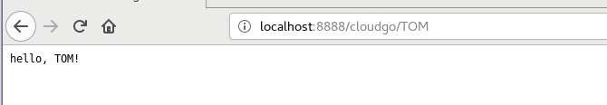
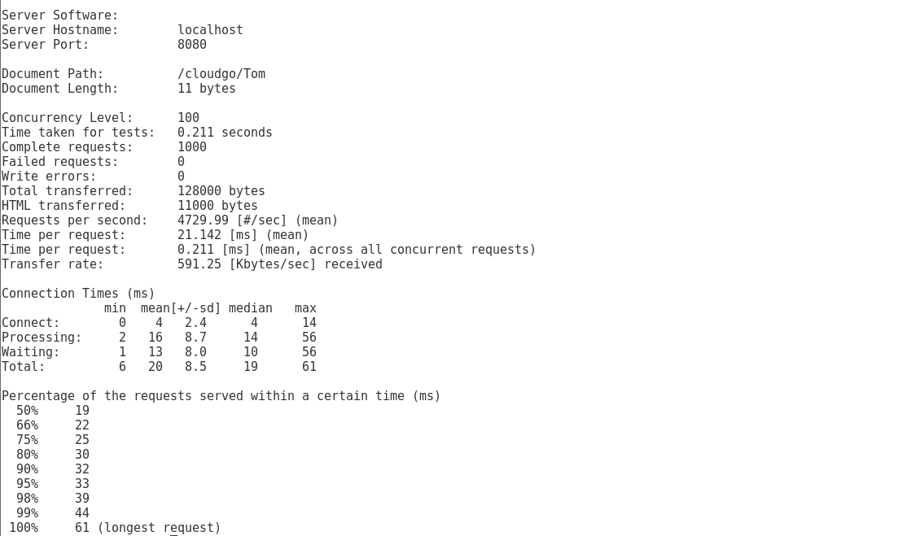

## cloudgo
---

### 框架

* 使用到`beego`框架

* 下载与安装

  ```go
  go get github.com/astaxie/beego
  ```

* 选择原因

  [官方文档](https://beego.me/docs/quickstart/)介绍的比较详细，总体比较好理解，使用起来简单快捷。不过`Martini`框架似乎也是比较简单易用的。

---

### 程序运行
* 命令 - `go run main.go -p 8888`

* 浏览器运行展示

    

---

### curl测试
* 命令 - `curl -v https://localhost:8888/cloudgo/TOM`
* 参数解释
    * `-v`，启用详细模式
    * [curl详情介绍](https://ec.haxx.se/usingcurl.html)
* 结果
  


---

### ab测试
* 前提
    * 需要安装`Apache web` 压力测试程序
    * `centos`安装 `Apache web` 压力测试程序
        ```
        yum -y install httpd-tools
        ```
* 命令 - `ab -n 1000 -c 100 http://localhost:8080/cloudgo/TOM`
    * 参数解释
        * `-n` - 执行的请求数量
        * `-c` - 并发请求个数
    * 其他参数
        * `-t` - 测试所进行的最大秒数
        * `-p` - 包含了需要POST的数据的文件
        * `-T` - POST数据所使用的Content-type头信息
        * `-k` - 启用HTTP KeepAlive功能，即在一个HTTP会话中执行多个请求，默认时，不启用KeepAlive功能
* 测试结果
  
    * 参数解释

        ```shell
        [cloud@centosBase ~]$ ab -n 1000 -c 100 http://localhost:8080/cloudgo/Tom
        This is ApacheBench, Version 2.3 <$Revision: 1430300 $>
        Copyright 1996 Adam Twiss, Zeus Technology Ltd, http://www.zeustech.net/
        Licensed to The Apache Software Foundation, http://www.apache.org/

        Benchmarking localhost (be patient)
        Completed 100 requests
        Completed 200 requests
        Completed 300 requests
        Completed 400 requests
        Completed 500 requests
        Completed 600 requests
        Completed 700 requests
        Completed 800 requests
        Completed 900 requests
        Completed 1000 requests
        Finished 1000 requests


        Server Software:        
        Server Hostname:        localhost   ###服务器主机名
        Server Port:            8080        ###端口

        Document Path:          /cloudgo/Tom    ### 请求的资源
        Document Length:        11 bytes        ### 文档返回的长度，不包括相应的报头

        Concurrency Level:      100             ### 并发个数
        Time taken for tests:   0.211 seconds   ### 总请求时间
        Complete requests:      1000            ### 完成的请求个数
        Failed requests:        0               ### 失败的请求个数               
        Write errors:           0
        Total transferred:      128000 bytes    ### 总共传输的字节
        HTML transferred:       11000 bytes     ### HTML传输的总字节数目
        Requests per second:    4729.99 [#/sec] (mean)  ### 平均每秒的请求数
        Time per request:       21.142 [ms] (mean)      ### 平均每个请求消耗的时间
        Time per request:       0.211 [ms] (mean, across all concurrent requests)   ### 每秒的平均请求除以并发数
        Transfer rate:          591.25 [Kbytes/sec] received    ### 传输速率

        ### 总体连接时间统计
        Connection Times (ms)
                    min  mean[+/-sd] median   max
        Connect:        0    4   2.4      4      14
        Processing:     2   16   8.7     14      56
        Waiting:        1   13   8.0     10      56
        Total:          6   20   8.5     19      61

        ### 百分之多少的请求完成对应的时间(ms)
        Percentage of the requests served within a certain time (ms)
        50%     19
        66%     22
        75%     25
        80%     30
        90%     32
        95%     33
        98%     39
        99%     44
        100%     61 (longest request)
        ```
* 参考链接： [ab测试参数解释](https://www.drupal.org/docs/develop/profiling-drupal/apache-bench-ab)

